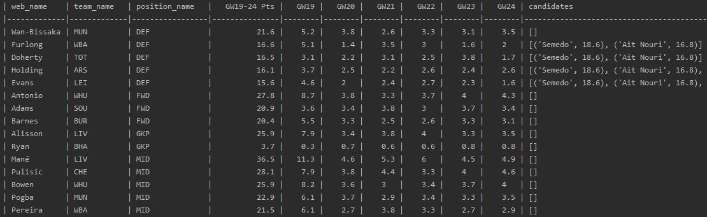
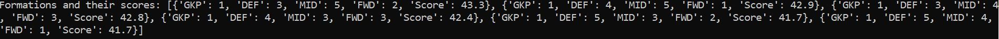

# FPL-draft-picker

FPL-draft-picker is a Python application for finding available players in the selected league that have a higher 
projected score than players already in the selected team. This application uses APIs available from 
draft.premierleague.com to obtain player data and then matches against the projections from fantasyfootballscout.co.uk.

## Output

**Team Suggestions**


**Formation Suggestions**


**Fixture Prediction**


## Getting Started

### Pre-requisites
* Python 3.8

### Installation
Use the package manager [pip](https://pip.pypa.io/en/stable/) to install FPL-draft-picker. Using Windows Command Prompt:

1. Create a virtual environment:
    ```bash
    py -m venv venv
    ```
2. Activate virtual environment:
    ```bash
    "venv/Scripts/activate.bat"
    ```
3. Install dependencies:
    ```bash
    pip3 install -r requirements.txt
    ```
   
### Usage
Run the script from the command line:

```python
app.py -myLeague <value> -myTeamName <value> -ffslogin <value> -ffspassword <value>
```
Values for the parameters can be found as per the below:
* myLeague - This can be found by inspecting the HTTP calls to `/api/league/` from draft.premierleague.com.
* myTeamName - The name of the team as shown at draft.premierleague.com.
* ffslogin - Fantasy football scout login.
* ffspassword - Fantasy football scout password.